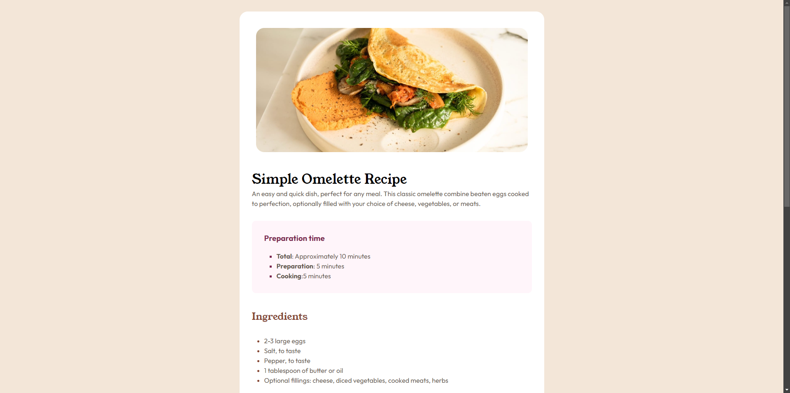
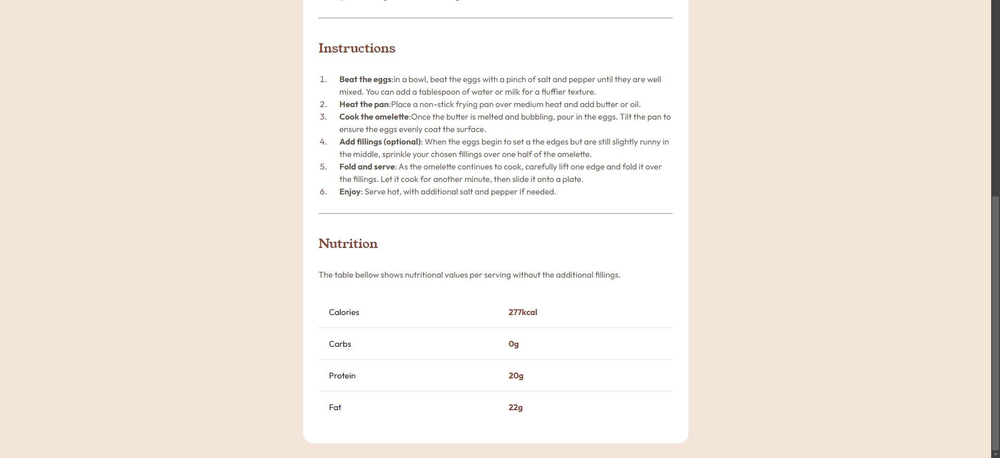

# Frontend Mentor - Recipe page

This is a solution to the [Recipe page Links challenge on Frontend Mentor](https://www.frontendmentor.io/challenges/). Frontend Mentor challenges help you improve your coding skills by building realistic projects. 

## Table of contents

- [Frontend Mentor - Recipe page](#frontend-mentor---Recipe page)
  - [Table of contents](#table-of-contents)
  - [Overview](#overview)
    - [Screenshot](#screenshot)
    - [Links](#links)
  - [My process](#my-process)
    - [Built with](#built-with)
    - [What I learned](#what-i-learned)
    - [Useful resources](#useful-resources)
  - [Author](#author)
  - [Acknowledgments](#acknowledgments)


## Overview

### Screenshot





### Links

- Solution URL: [Recipe page](https://github.com/7A9Oo/Recipe-page)
- Live Site URL: [Recipe page](https://recipe-page-seven-liart.vercel.app/)

## My process

### Built with

- Semantic HTML5 markup
- CSS custom properties
- Flexbox

### What I learned

in this project i learned how to use media queries so i design first for mobile after that i work with desktop 


 code snippets:

```css
/* media for desktop */
@media (min-width:376px){
    body {
        background-color: var(--stone-100);
        display: flex;
        flex-direction: column;
        justify-content: center;
        align-items: center;
        margin: 30px;
    }
    
    .parent {
        width: 740px;
        background-color: var(--white);  
        border-radius: 20px; 
    }
    .parent .image {
        padding-right: var(--large-padmar);
        padding-left: var(--large-padmar);
        padding-top: var(--large-padmar);
    }
    .parent img  {
        border-radius: 20px;
        
    }
}
/* end media for desktop */
```

### Useful resources

- [elzero ](https://elzero.org/) - This web site helped me for learning HTML and CSS and Git. I really liked this pattern and will use it going forward.
- [Frontend mentor](https://www.frontendmentor.io/) - this website help me to init project and deal with details like margin and padding and community.


## Author

- Frontend Mentor - [@7A9Oo](https://www.frontendmentor.io/profile/7A9Oo)
- Facebook - [Abdelhak Med](https://www.facebook.com/profile.php?id=100085050074290)


## Acknowledgments

I would like to express my heartfelt gratitude to Osama Elzero and this website (frontend mentor) for invaluable assistance. his support and guidance have been tremendously helpful, and I am truly grateful for his time and effort.


